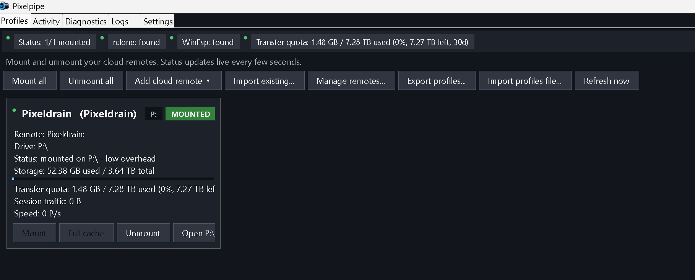
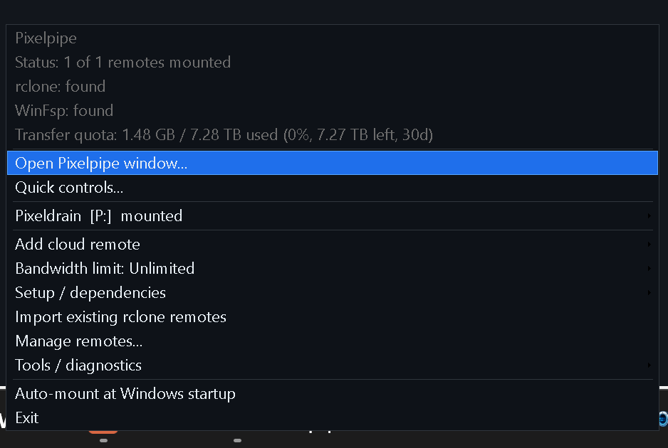
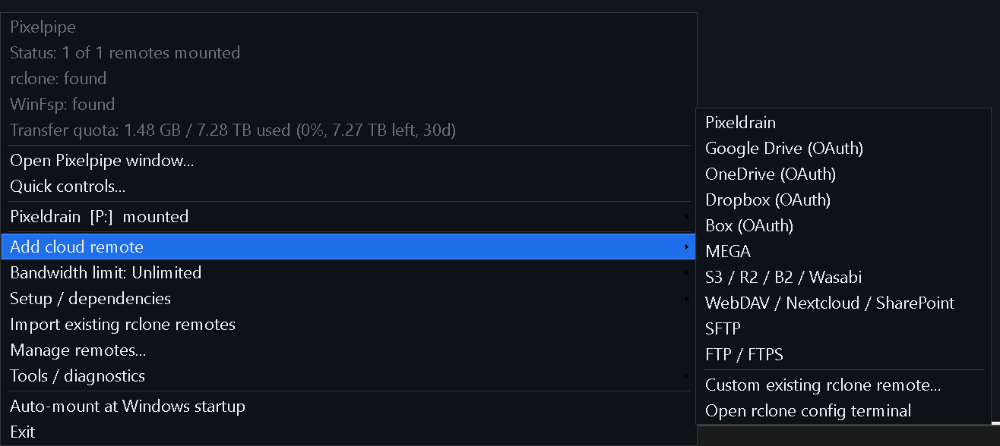

<a href="https://github.com/NathanNeurotic/Pixelpipe/releases/tag/rolling" target="_blank"></a>

# Pixelpipe

Pixelpipe is a small Windows tray app that mounts rclone-compatible cloud remotes as Windows drives.

It is Pixeldrain-first, but not Pixeldrain-only. The app can manage Pixeldrain, Google Drive, MEGA, OneDrive, Dropbox, Box, S3-compatible storage, WebDAV / Nextcloud / SharePoint, SFTP, FTP / FTPS, and existing custom rclone remotes.

Use it when you want a tray-controlled cloud drive with mount/unmount buttons, logs, diagnostics, bandwidth controls, scheduled mounts, watch-folder uploads, and recovery tools for the times Windows or rclone gets stuck.

## Start here

Most users only need this path:

1. Download `Pixelpipe.exe`, `Pixelpipe-Windows-x64.zip`, or `Pixelpipe-Setup.exe` from the latest release.
2. Run Pixelpipe normally, not as Administrator.
3. If Windows SmartScreen appears, click **More info**, then **Run anyway**.
4. Let the first-run wizard check rclone, WinFsp, and your first remote.
5. Right-click the tray icon to mount, unmount, add remotes, open logs, or run diagnostics.

For a guided walkthrough, see [docs/USER_GUIDE.md](docs/USER_GUIDE.md).

## What Pixelpipe does

- Mounts each configured remote to its own Windows drive letter.
- Keeps multiple profiles in one tray menu and main window.
- Provides guided setup for common rclone providers.
- Imports existing rclone remotes with `rclone listremotes`.
- Shows live status, storage where the provider reports it, speed, and session traffic for Pixelpipe-launched mounts.
- Shows Pixeldrain transfer quota when a Pixeldrain API key is configured.
- Applies global and per-profile bandwidth limits through rclone RC.
- Supports per-profile bandwidth schedules, such as slower daytime limits and unlimited overnight transfer.
- Supports scheduled mount and unmount times per profile.
- Can watch a local folder and upload new files to a remote by copy or move.
- Stores Pixelpipe settings under `%APPDATA%\Pixelpipe\`.
- Stores logs under `%LOCALAPPDATA%\Pixelpipe\logs\`.
- Keeps timestamped settings backups before destructive profile operations.
- Includes diagnostics, preflight checks, stale-drive cleanup, and orphan rclone process repair.

Pixelpipe is not a sync engine. It does not replace rclone's own sync/copy commands, and it does not turn normal public Pixeldrain file links into a writable filesystem.

## Provider support

Pixelpipe uses rclone as the provider layer.

| Tier | Providers | What Pixelpipe handles |
| --- | --- | --- |
| 1 | Pixeldrain | Guided Pixeldrain profile, rclone remote setup, optional API key, encrypted quota key storage, storage and transfer-quota display. |
| 2 | Google Drive, MEGA, OneDrive, Dropbox, Box, S3 / R2 / B2 / Wasabi / DigitalOcean / Storj, WebDAV / Nextcloud / SharePoint, SFTP, FTP / FTPS | Profile setup, mount/unmount, drive letters, logs, diagnostics, bandwidth, schedules, watch folders. Provider-specific login still belongs to rclone where needed. |
| 3 | Custom rclone remotes | Import any remote that appears in `rclone listremotes`, assign a drive letter, and manage it from Pixelpipe. |

Provider-specific quota is not guaranteed for every backend. Generic storage usage appears when `rclone about <remote> --json` supports it.

## Interfaces

Pixelpipe has three everyday surfaces:

**Tray menu**: right-click the tray icon. This is the fastest route to mount, unmount, add a cloud remote, change bandwidth, run setup, copy diagnostics, open logs, and repair stuck mounts.

**Main window**: choose `Open Pixelpipe window...` from the tray. It has tabs for Profiles, Activity, Diagnostics, Logs, and Settings.

**Quick controls popup**: choose `Quick controls...` from the tray. It is a compact always-on-top panel for aggregate speed, session traffic, bandwidth, and per-profile status.

## Screenshots

The main-window Profiles tab:



The tray menu:



Adding a cloud remote:



More screenshots are in [docs/SCREENSHOTS.md](docs/SCREENSHOTS.md).

## Requirements

Pixelpipe is for Windows 10/11.

It needs:

- rclone
- WinFsp
- at least one configured rclone remote

The first-run wizard can help install or find rclone and WinFsp. Pixelpipe can also download a portable rclone build to:

```text
%USERPROFILE%\Apps\rclone\rclone.exe
```

Pixeldrain filesystem access requires Pixeldrain's filesystem feature. Pixelpipe does not make ordinary public Pixeldrain links mountable as a drive.

## Download choices

| Download | Use when |
| --- | --- |
| `Pixelpipe.exe` | You want one portable executable. Drop it anywhere and run it. |
| `Pixelpipe-Windows-x64.zip` | You want the portable executable plus README, license, and docs together. |
| `Pixelpipe-Setup.exe` | You want Start Menu registration, optional Desktop shortcut, optional startup entry, and an Add/Remove Programs entry. Installs per-user to `%LOCALAPPDATA%\Programs\Pixelpipe\`. |

All formats use the same settings file. You can move between portable and installed builds without losing profiles.

## First-run SmartScreen warning

Pixelpipe builds are not code-signed. Windows SmartScreen may show **"Windows protected your PC"** and call the file an unrecognized app the first time you run a downloaded build.

That warning is expected for unsigned open-source software. It is not, by itself, a malware detection.

To run Pixelpipe:

1. Click **More info**.
2. Click **Run anyway**.

To verify the download first, compare the release's `SHA256SUMS.txt` with:

```powershell
Get-FileHash .\Pixelpipe.exe -Algorithm SHA256
```

Do not run Pixelpipe as Administrator unless you intentionally need an elevated mount. Admin-mounted drives can be hidden from normal File Explorer.

## Common workflows

### Add a remote

Right-click the tray icon:

```text
Add cloud remote
```

Choose a provider. OAuth providers such as Google Drive, OneDrive, Dropbox, and Box use rclone's own browser sign-in flow. Credential-form providers collect the needed fields once, write them into rclone's config, then create the Pixelpipe profile.

### Import existing remotes

If you already use rclone:

```text
Import existing rclone remotes
```

Pixelpipe reads `rclone listremotes`, skips remotes it already knows about, and assigns available drive letters.

### Test a profile before mounting

Open a profile menu and choose:

```text
Test profile
```

The preflight checks rclone, WinFsp, the remote config, drive-letter availability, RC port availability, and backend storage response.

### Change bandwidth

Use:

```text
Bandwidth limit
```

Bandwidth changes apply live to Pixelpipe-launched mounts through rclone RC. Per-profile overrides and bandwidth schedules live in the profile editor.

### Use schedules or watch folders

Open the main window, go to Profiles, open a profile's menu, and choose `Edit`.

- General: label, provider, remote, drive letter, mount mode, startup auto-mount.
- Bandwidth: per-profile bandwidth limit and optional time-based bandwidth schedule.
- Schedule: automatic mount and unmount times by day.
- Watch: upload new files from a local folder by copy or move.

Details are in [docs/USER_GUIDE.md](docs/USER_GUIDE.md).

## Diagnostics and repair

Start here when something feels wrong:

```text
Tools / diagnostics -> Copy diagnostics
```

Diagnostics include dependency status, profile settings, mount state, RC ports, storage text, speed/session data, watch-folder state, log paths, and recent log tails. Secret-looking values are scrubbed before copying.

Useful repair actions are also under `Tools / diagnostics`, including log folder access, settings backups, stale-drive cleanup, and orphan rclone process scanning.

## Command-line flags

```text
Pixelpipe.exe /automount        Mount every profile with AutoMount=true. Used by the Windows startup entry.
Pixelpipe.exe /smoketest-menu   Run tray-menu placement/theme checks, then exit 0/non-zero. Used by CI.
```

You normally do not need to run these by hand.

## Building from source

From the repository root:

```powershell
.\scripts\build-release.ps1
.\scripts\run-tests.ps1
```

Or use the SDK-style project files:

```powershell
dotnet build -c Release Pixelpipe.csproj
dotnet run --project Pixelpipe.Tests.csproj -c Release
```

The PowerShell scripts remain the canonical CI build path. The `.csproj` files are for IDEs, analyzers, and developer convenience.

For contributor details, see [CONTRIBUTING.md](CONTRIBUTING.md) and [docs/DEVELOPMENT.md](docs/DEVELOPMENT.md).

## Documentation map

- [User guide](docs/USER_GUIDE.md): friendly walkthrough for setup and everyday use.
- [FAQ](docs/FAQ.md): quick answers.
- [Troubleshooting](docs/TROUBLESHOOTING.md): symptom-first fixes.
- [Configuration reference](docs/CONFIGURATION.md): settings file and profile fields.
- [Multi-remote support](docs/MULTI_REMOTE.md): provider tiers and limitations.
- [Screenshots](docs/SCREENSHOTS.md): visual tour.
- [Development](docs/DEVELOPMENT.md): source layout, build, tests, CI.
- [Smoke test checklist](docs/SMOKE_TEST.md): manual QA pass.
- [Documentation audit](docs/DOCUMENTATION_AUDIT.md): what this docs pass verified and how to prevent drift.
- [Security](SECURITY.md): secrets, logs, admin guidance, vulnerability reporting.

## Security notes

- Pixelpipe does not store provider passwords in `settings.json`.
- The optional Pixeldrain API key is encrypted with Windows DPAPI for the current Windows user.
- Other provider credentials are stored by rclone in rclone's own config system.
- Pixelpipe does not need Administrator by default.
- Downloads are unsigned, so SmartScreen may warn on first run. Verify with `SHA256SUMS.txt` if you want extra certainty before running.
