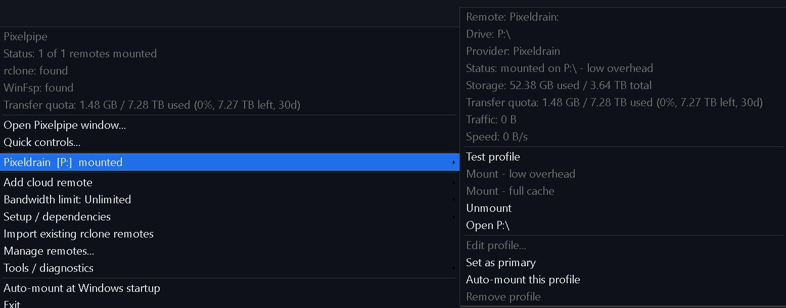
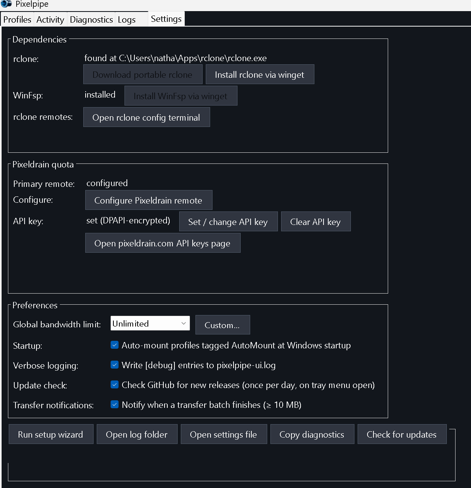

# Screenshots

Captured from Pixelpipe v0.15.4 on Windows 11. All images live in `docs/screenshots/`.

## Main window — Profiles tab

The dashboard. Each profile is a card with a status dot, drive-letter chip, mounted/unmounted pill, a dark themed storage gauge, live transfer-quota / session / speed numbers, and the four primary actions (Mount / Full cache / Unmount / Open). The status strip across the top shows global status, rclone, WinFsp, and transfer-quota chips — each with its own colour dot.

## Tray menu

Right-click the tray icon. The disabled header block shows live status (mounted count, rclone / WinFsp presence, transfer quota), then window shortcuts, each profile as a submenu, and the management / setup / tools entries.

## Per-profile tray submenu

Hovering a profile expands its full detail — remote, drive, provider, status, storage, transfer quota, traffic, speed — plus every action: Test, Mount (low overhead / full cache), Unmount, Open, Edit, Set as primary, Auto-mount, Remove.

## Add cloud remote

Nine first-class providers plus custom rclone remotes. OAuth providers (Drive, OneDrive, Dropbox, Box) complete sign-in through the rclone config terminal; the rest collect credentials in an in-app form and never put secrets on the command line.

## Settings tab

Dependencies (rclone / WinFsp / rclone-remotes), Pixeldrain quota + DPAPI-encrypted API key management, and Preferences (global bandwidth, startup auto-mount, verbose logging, update check, transfer notifications), with a maintenance row along the bottom.

